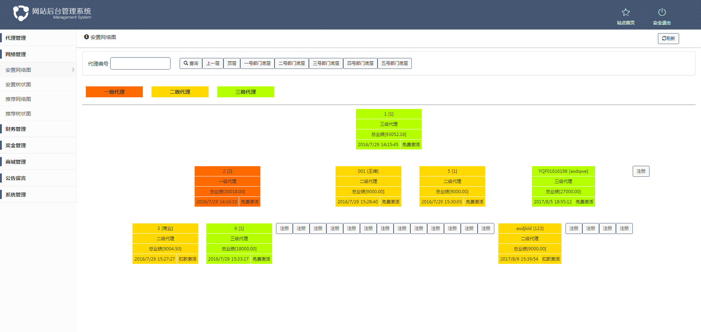
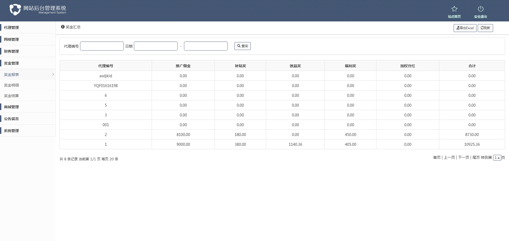
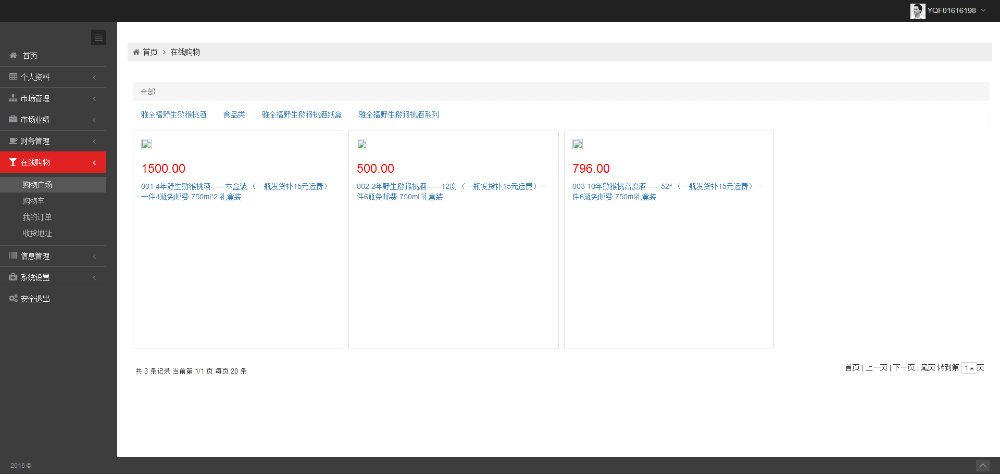

#### 1.简介

​	这里提供稳定、半开源的多套资产证券类直销系统,支持双轨制、五级三阶制、三轨制、太阳线、等各种制度的奖金结算系统

#### 2.环境配置

​	运行环境：windows系列 + IIS + Sql Server 2008 R2

​	开发语言：C#

#### 3.功能介绍

- 会员：会员下设五个部门，新会员由老会员使用注册积分推荐注册（购买产品达到一定额度才可享受平台奖励），若等级不为最高级别可补足差额申请职称升级。

- 奖金：网站设三个等级，不同等级对应不同投资金额、股权、推荐奖、见点奖、极差奖及每日分红，每个会员可根据推荐人数获得福利奖。

- 财务：查看每日的奖金、财务明细及积分兑换、积分转账、充值提现

- 商城：商城可发布产品供会员使用消费积分进行购物

#### 4.平台登录

- 用        户：http://xxx.xxx.xxx/vip/user/login

  - 测试用户可到后台进行注册添加

    

- 后台管理：http://xxx.xxx.xxx/system/login

  - 帐号：admin

  - 密码：3.3

  - 二级密码：3.3

    